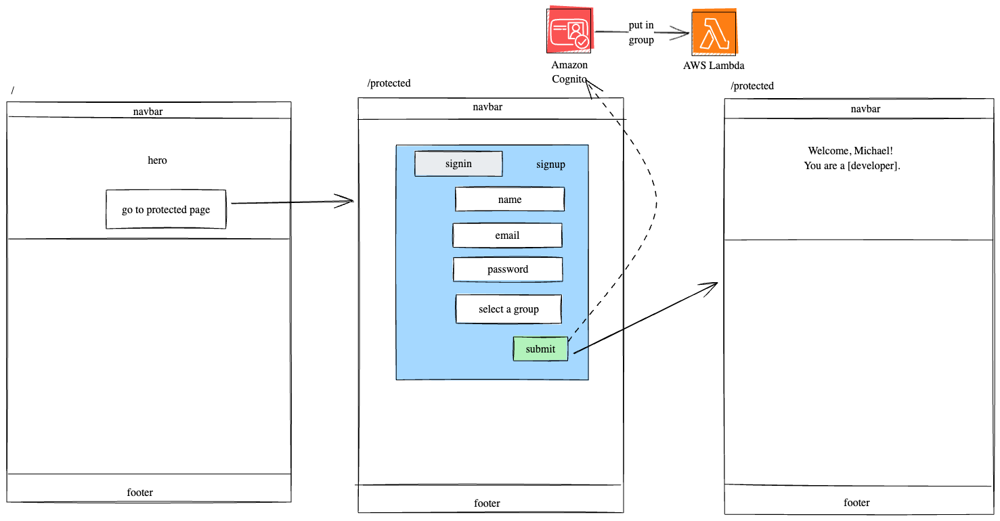

# Fullstack PostConfirmation Trigger

This project demonstrates how a postconfirmation trigger can be used to assign a user to a group after they are successfully authenticated.

## Stack

- AWS Amplify
  - Amazon Cognito
  - AWS Lambda
- Vite + React Router
- Tailwind via DaisyUI
